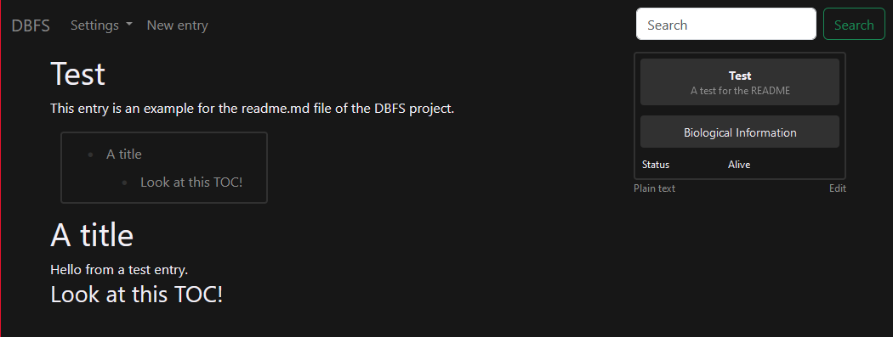
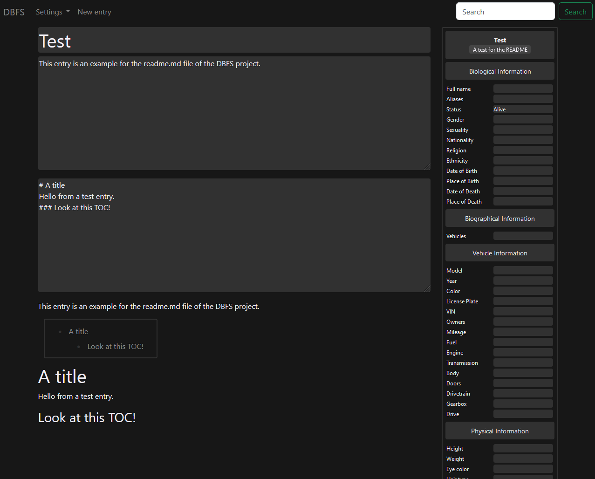

# DBFS

DBFS (short for "DataBase For Stalkers" 💀) is a lightweight wiki software which focuses on storing information about real life stuff, mainly people, vehicles, locations.

# Selling points

I've used selfhosted [mediawiki](https://www.mediawiki.org/) and [Obsidian](https://obsidian.md/) in the past but I found both of them not perfect. The mediawiki is good, but I hate that everything is stored in a database. I wanted local files so I chose Obsidian with a lot of extensions. But I hated infoboxes. I like dynamic infoboxes. So I've tried to combine these two pieces of software into one.

## Infoboxes

This is an example of storing an infobox in a file.

```json
{
  "fileName": "Test",
  "meta": {
    "title": "Test",
    "subtitle": "A test for the README"
  },
  "infobox": {
    "status": "Alive"
  },
  "content": {
    "summary": "This entry is an example for the readme.md file of the DBFS project.",
    "full": "# A title\nHello from a test entry.\n### Look at this TOC!"
  }
}
```



The infobox is looped through and its values are organized under appropriate categories based on a [big template](src/infobox.json) (similar to MediaWiki, although on mediawiki people prefer to use different templates for each category like Human, Vehicle, etc). With this functionality, you can easily move the "status" to another category, and it will be updated for every file, unlike in Obsidian.

# Screenshots

### Mobile view

[Mobile View](.github/mobileView.png)

### Live editor (also works for new files)


